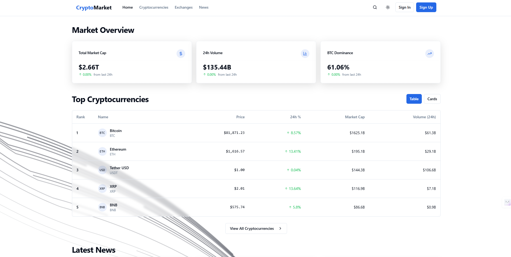

# CryptoMarket

CryptoMarket is a complete cryptocurrency tracking and information platform built with [Next.js](https://nextjs.org/), [TailwindCSS](https://tailwindcss.com/), and [Redux Toolkit](https://redux-toolkit.js.org/). It integrates various cryptocurrency APIs to display real-time data on coins, exchanges, and trends.




## Features

- **Market Overview Dashboard**: Global stats for all supported cryptocurrencies
- **Cryptocurrency Explorer**: Browse and search hundreds of coins
- **Price Charts**: Interactive charts with multiple time ranges (e.g., 1D, 7D, 1M)
- **Exchange Directory**: Trust score, trading volume, and data about crypto exchanges
- **News**: Latest crypto news from multiple sources
- **Dark/Light Theme**: Automatic detection of user preference
- **Responsive Design**: Works on mobile, tablet, and desktop

## Tech Stack

- **Framework**: [Next.js](https://nextjs.org/)
- **UI Libraries**:  
  - [TailwindCSS](https://tailwindcss.com/)  
  - [Radix UI](https://radix-ui.com/)  
  - [Lucide Icons](https://lucide.dev/)  
- **State Management**:  
  - [Redux Toolkit](https://redux-toolkit.js.org/)  
  - [RTK Query](https://redux-toolkit.js.org/rtk-query/overview)  
- **Charts**: [Recharts](https://recharts.org/)
- **Deployment**: [Vercel](https://vercel.com/)

## Project Structure

crypto-market/  
├── [app](app/)  
│   ├── [cryptocurrencies](app/cryptocurrencies/)  
│   ├── [exchanges](app/exchanges/)  
│   ├── [news](app/news/)  
│   ├── [services](app/services/)  
│   └── index.js, layout.tsx, page.tsx, etc.  
├── [components](components/)  
│   ├── [crypto-detail.tsx](components/crypto-detail.tsx) → [`CryptoDetail`](components/crypto-detail.tsx) component  
│   ├── [exchange-detail.tsx](components/exchange-detail.tsx) → [`ExchangeDetail`](components/exchange-detail.tsx) component  
│   └── ui/  
├── [hooks](hooks/)  
├── [lib](lib/)  
├── [public](public/)  
└── [styles](styles/)  

## Getting Started

### Prerequisites
- Node.js >= 18.x
- npm or pnpm

### Installation

1. Clone this repository:
    
    ```bash
    git clone https://github.com/ansu555/crypto-market.git
    cd crypto-market
    ```
2. Install dependencies:
    
    ```bash
    npm install
    # or
    pnpm install
    ```
3. Start development server:
    
    ```bash
    npm run dev
    # or
    pnpm dev
    ```
4. To access the site, open http://localhost:3000 in your browser.

### Building and Deployment

Use the scripts in [package.json](package.json) to build and run:

```bash
npm run build
npm run start
```
Using the Components
Display a specific cryptocurrency with CryptoDetail

For quick hosting, deploy on Vercel. Connect your repository to Vercel, then click “Deploy.”

<CryptoDetail id="bitcoin" />

Show exchange details via ExchangeDetail:

<ExchangeDetail id="binance" />
